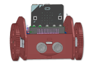

# Borsuk - Robot

Projekt Robota oparty na podstawce sterownika silników i serw od waveshare electronics. Urządzeniem dsterującym jest Micro:bit.
Robot wykonany jest ze sklejki i porusza się na szerwach 360 stopni. Stopniowo dodawanae będą kolejne funkcje oraz moduły robota.

## Zmiany względem oryginału
Projekt źródłowy: https://github.com/waveshare/pxt-Motor
Dodane zostały funkcje sterowania serwami 360 stopni:
* ServoMotorForward - jazda serwem do przodu.
* ServoMotorBackward - Jazda serwem do tyłu. 
* ServoMotorStop - zatrzymanie serwa

## Licencja

MIT
